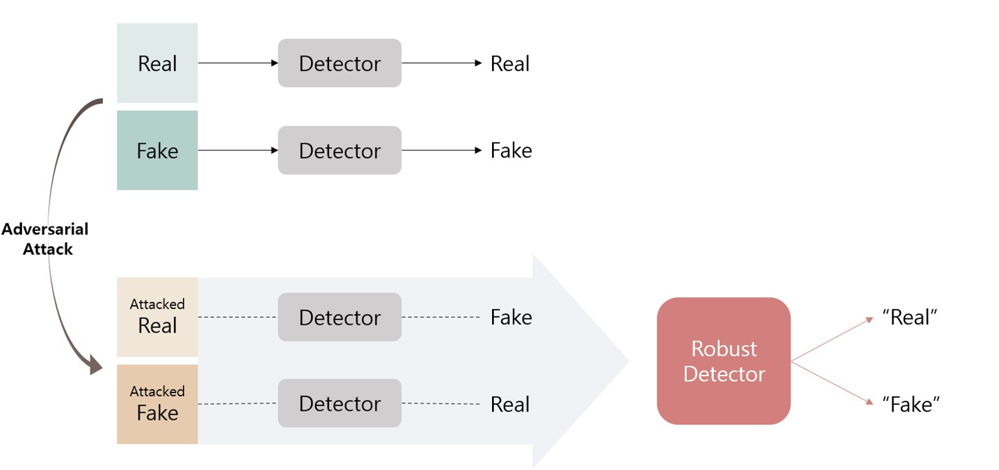
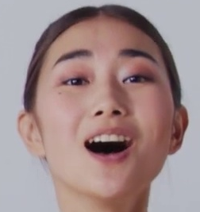
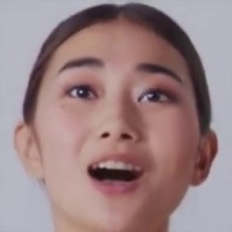
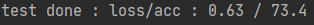
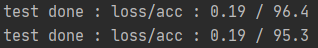
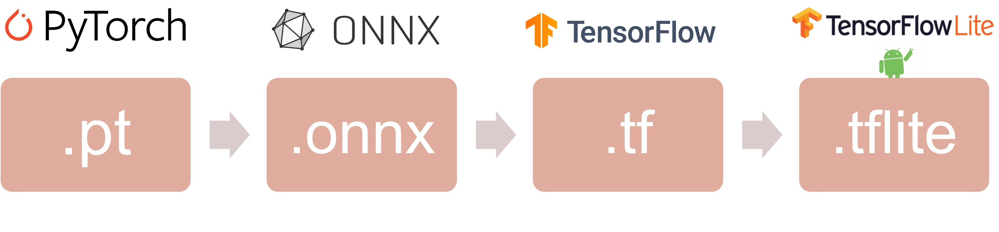
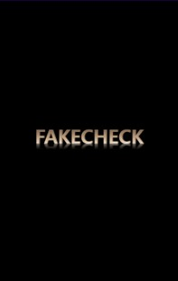
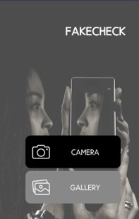
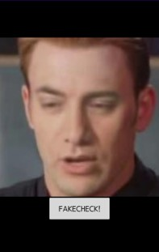
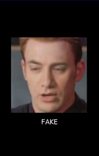

# Fake Check
요즈음 ‘딥페이크’로 인해 피해를 받는 사람들이 늘어나고 있다. 유명인의 얼굴부터 일반인들의 얼굴까지 가짜로 만들어내어 해당 사람이 전혀 하지 않은 행동을 하고 있는 이미지나 영상이 만들어지는 것이다.
이를 방지하기 위해 딥페이크를 판별하는 여러 모델이 존재하지만, 판별기를 무력화 시키기 위해 제안된 Adversarial Attack에 아직은 취약하다.
deepfake로 인한 피해를 줄이기 위해서 모델 방해공격(adversarial attack)에도 robust한 모델을 구축하고, 애플리케이션을 구현하여 deepfake 방어에 대해 사람들의 접근성을 높이는 것을 목표로 본 과제를 수행했다.
<br>
## DATA
* 유명인의 실제 영상과 deepfake가 적용된 영상으로 구성된 데이터 셋인 Celeb-DF 총 8,000장
* 직접 촬영한 팀원들의 얼굴 영상과 저작권이 없는 얼굴 이미지를 수집한 뒤 deepfake를 적용한 이미지 데이터셋 총 1,000장
* MTCNN 모델을 이용하여 얼굴 부분만 crop

|REAL|FAKE|
|---|---|
|||
## MODEL
* Transfer learning: EfficientNet-b0
* Otimizer: Momentum SGD
* Learning rate scheduler: MultiplicativeLR(epoch: 0.98739)
* Data Preprocessing: resize(224), totensor
* Dropout: (default) 0.2
* Batch size: 128
* Epoch: 30<br>
모델은 이미지 분류 부분에서 월등히 높은 성능을 보인 EfficientNet을 사용하였고 GPU환경에서 학습시키기 위해 pytorch모듈을 기반으로 하였다.
모델은 adversarial training과 image processing defense방법을 적용하여 기존의 모델보다 더 robust하도록 생성하였다.


### 1. Adversarial Training
- 데이터를 로드한 후 adversarial example 생성 -> train set에 adversarial attack이 들어간 image 추가
- 이미지 전처리에서 normalize를 적용한 결과 pixel값(-1&#126;1)과 adversarial attack에 대한 input값(0&#126;1)이 다름 -> 모델에 normalize를 수행하는 layer 추가
- adversarial training은 여러 케이스 중 성능이 가장 높게 나온 6(adv img):4(ori img)의 비율로 학습한 모델을 선택하여 진행

|model|origin data로 test|adv data로 test|
|---|---|---|
|adv_training<br>ori:adv = 4:6|||


### 2. Image Processing Defense
- Resizing<br>Resizing은 local interpolation을 통해 smoothing 효과를 나타내기 때문에 adversarial example의 perturbation(noise)를 일부 제거하는 효과가 있다. 여러 비율로 resizing 해본 결과, 가장 높은 공격 방어율을 보인 3배 비율을 이미지에 적용하였다.

```python
	tensor2pil.resize((74, 74))
	tensor2pil.resize((224, 224))
```

- JPEG압축<br>JPEG 압축은 이미지의 고주파 구성요소를 압축하고, adversarial perturbation도 고주파에 속하기 때문에 JPEG 압축을 통해 공격 효과를 줄일 수 있다. 많은 테스트 결과 quality factor가 15일 때 가장 적절했으며, 이는 선형적 변환인 resizing보다 공격 방어율이 더 높다는 것을 확인해 볼 수 있었다.

```python
    encode_param = [int(cv2.IMWRITE_JPEG_QUALITY, 15]
    result, encimg = cv2.imencode('.jpg', cv_img, encode_param)
```


## MODEL CONVERSION



## APP
- MTCNN을 이용한 얼굴 검출
- 모델의 input 이미지 형식 맞추기: RGB -> BRG, 이미지 차원 변환
- tflite로 변환한 모델 실행 -> Real/Fake 결과 반환

|Intro|Main|Detect|Result|
|---|---|---|---|
|||||
